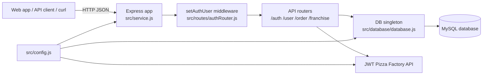
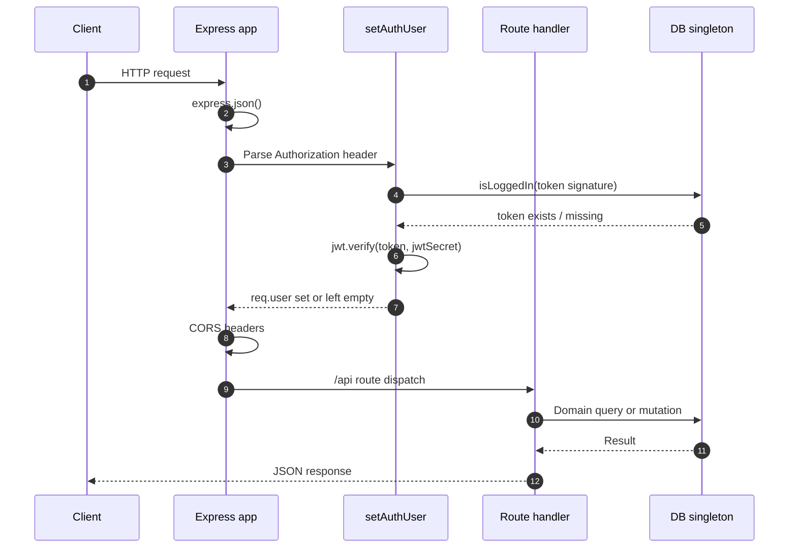
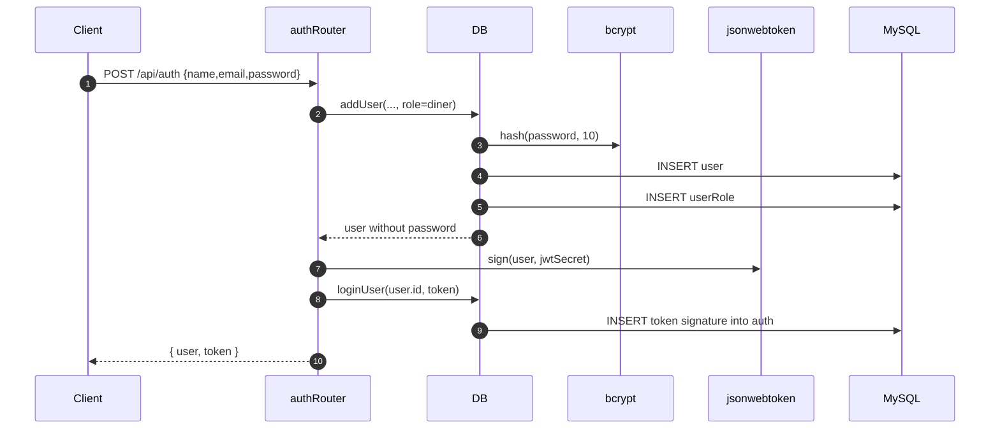
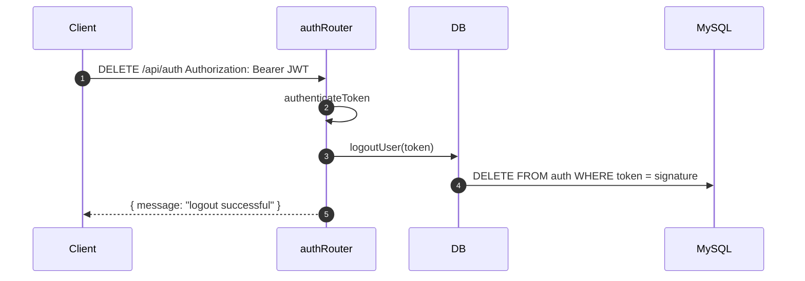
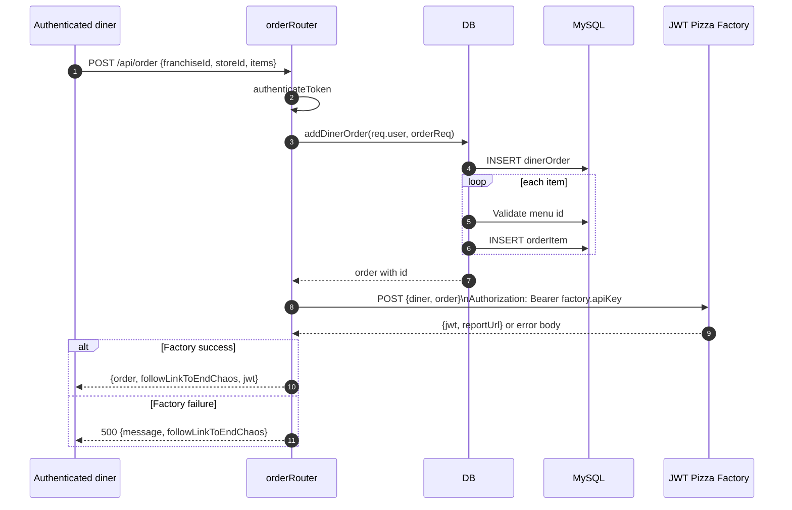
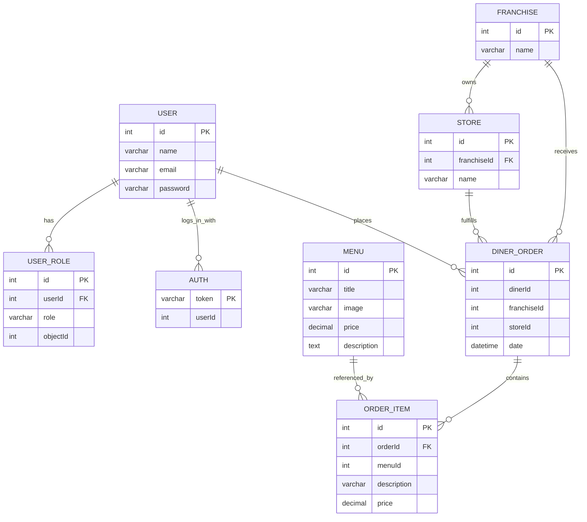
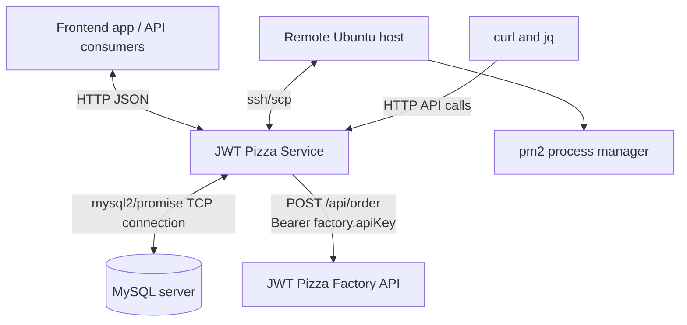

# JWT Pizza Service Architecture

This document explains how the JWT Pizza Service is organized, how requests move through the application, where data is stored, and where this service integrates with other systems. It is intended to help a new engineer build a useful mental model before making code changes.

## High-Level Purpose

JWT Pizza Service is an Express-based Node.js API for a pizza ordering domain. It manages:

- User registration, login, logout, and profile updates.
- JWT-based authentication with server-side session revocation.
- Menu management.
- Franchise and store management.
- Diner order storage.
- Order fulfillment through the external JWT Pizza Factory API.

The service is not just a stateless JWT API. It signs JWTs, but it also stores token signatures in MySQL so logout can invalidate a token before it naturally expires.

## Runtime Overview



At startup, `src/index.js` imports the Express app from `src/service.js` and listens on the configured command-line port or `3000` by default.

```text
npm start
  -> cd src && node index.js
  -> require('./service.js')
  -> app.listen(port)
```

The application depends on a local, ignored `src/config.js` file. The README shows the expected shape:

- `jwtSecret`: secret used to sign and verify JWTs.
- `db.connection`: MySQL connection details.
- `db.listPerPage`: default order pagination size.
- `factory.url`: external pizza factory base URL.
- `factory.apiKey`: bearer token used when calling the factory service.

## Source Layout

```text
src/
  index.js                    Process entry point.
  service.js                  Express app assembly, middleware, routes, docs, errors.
  init.js                     CLI helper for creating an admin user.
  endpointHelper.js           Shared async route wrapper and HTTP error class.
  version.json                Version reported by root and docs endpoints.
  model/
    model.js                  Shared role constants.
  routes/
    authRouter.js             Register, login, logout, auth middleware.
    userRouter.js             Current user and user update endpoints.
    orderRouter.js            Menu and order endpoints; factory integration.
    franchiseRouter.js        Franchise/store endpoints and access checks.
  database/
    database.js               MySQL access layer and startup DB initialization.
    dbModel.js                Table creation statements.
```

There are also two operational scripts:

- `generateData.sh`: calls the public API to seed users, menu items, a franchise, and a store.
- `deployService.sh`: packages the service, copies it to a remote host with `scp`, installs dependencies, and restarts it with `pm2`.

## Request Pipeline

Every request flows through the middleware configured in `src/service.js`:



Important details:

- JSON bodies are parsed globally with `express.json()`.
- `setAuthUser` runs for every route, including public routes.
- CORS headers allow the request origin, methods `GET, POST, PUT, DELETE`, and headers `Content-Type, Authorization`.
- Authenticated routes use `authRouter.authenticateToken`, which requires `req.user`.
- Errors thrown from async route handlers are passed through `asyncHandler` to the default Express error handler.

## Authentication Model

Authentication lives mostly in `src/routes/authRouter.js` and `src/database/database.js`.



Login follows the same final steps after `DB.getUser(email, password)` verifies the password with `bcrypt.compare`.

Logout deletes the token signature from the `auth` table:



Token storage uses only the JWT signature segment, extracted by splitting on `.` and keeping the third part. During future requests, `setAuthUser` checks whether that signature exists in `auth` before trusting the JWT payload.

## Roles and Authorization

Roles are defined in `src/model/model.js`:

```js
const Role = {
  Diner: 'diner',
  Franchisee: 'franchisee',
  Admin: 'admin',
};
```

Roles are persisted in `userRole`:

- `admin`: global administrator, stored with `objectId = 0`.
- `diner`: normal customer, stored with `objectId = 0`.
- `franchisee`: franchise administrator, stored with `objectId = franchise.id`.

When a JWT is verified, `setAuthUser` attaches `req.user.isRole(role)`, a helper used by route handlers.

Main authorization rules:

- Anyone can register, login, view the menu, list franchises, read root metadata, and read `/api/docs`.
- Any authenticated user can fetch their own profile and orders.
- A user can update their own profile; admins can update any user.
- Only admins can add menu items.
- Only admins can create franchises.
- Admins and assigned franchisees can create or delete stores in a franchise.
- Users can view their own franchises; admins can view any user's franchises.

Notable implementation detail: `DELETE /api/franchise/:franchiseId` currently does not use `authenticateToken` in the router even though its docs say it requires auth. Treat that as an important behavior to verify before relying on the endpoint in production.

## API Surface

The service mounts all API routes under `/api`:

```mermaid
flowchart TD
    API[/api/] --> Auth[/auth/]
    API --> User[/user/]
    API --> Order[/order/]
    API --> Franchise[/franchise/]
    API --> Docs[/docs/]

    Auth --> Register[POST /api/auth\nregister diner]
    Auth --> Login[PUT /api/auth\nlogin]
    Auth --> Logout[DELETE /api/auth\nlogout]

    User --> Me[GET /api/user/me]
    User --> UpdateUser[PUT /api/user/:userId]
    User --> DeleteUser[DELETE /api/user/:userId\nnot implemented]
    User --> ListUsers[GET /api/user\nnot implemented]

    Order --> Menu[GET /api/order/menu]
    Order --> AddMenu[PUT /api/order/menu]
    Order --> Orders[GET /api/order]
    Order --> CreateOrder[POST /api/order]

    Franchise --> ListFranchises[GET /api/franchise]
    Franchise --> UserFranchises[GET /api/franchise/:userId]
    Franchise --> CreateFranchise[POST /api/franchise]
    Franchise --> DeleteFranchise[DELETE /api/franchise/:franchiseId]
    Franchise --> CreateStore[POST /api/franchise/:franchiseId/store]
    Franchise --> DeleteStore[DELETE /api/franchise/:franchiseId/store/:storeId]
```



`GET /api/docs` returns generated endpoint metadata by concatenating `docs` arrays exported on each router. It also returns the configured factory URL and database host.

## Order Fulfillment Flow

Orders are handled in `src/routes/orderRouter.js`.



The database write happens before the factory call. If the factory call fails, the local order remains stored. There is no compensating delete or retry queue in the current implementation.

## Database Architecture

The `DB` class in `src/database/database.js` is instantiated once and exported as `DB`. Its constructor immediately starts `initializeDatabase()`. Every public DB method waits for initialization before opening a connection.

Startup initialization does the following:

1. Connects to MySQL without selecting a database.
2. Checks `INFORMATION_SCHEMA.SCHEMATA` for the configured database.
3. Creates the database if needed.
4. Runs every `CREATE TABLE IF NOT EXISTS ...` statement from `src/database/dbModel.js`.
5. If the database did not previously exist, creates a default admin user with email `a@jwt.com` and password `admin`.

Most DB methods use short-lived connections:

```text
DB method
  -> getConnection()
  -> run one or more SQL statements
  -> connection.end()
```

The main exception is operations that need consistency, such as `deleteFranchise`, which wraps related deletes in a transaction.

## Data Model



The SQL schema only declares some of these relationships as foreign keys. For example:

- `store.franchiseId` references `franchise.id`.
- `userRole.userId` references `user.id`.
- `orderItem.orderId` references `dinerOrder.id`.

Other relationships are represented by IDs and indexes but not enforced by database-level foreign keys, including `auth.userId`, `dinerOrder.dinerId`, `dinerOrder.franchiseId`, `dinerOrder.storeId`, and `orderItem.menuId`.

## Main Code Paths

### Register

`POST /api/auth`

1. Validates `name`, `email`, and `password`.
2. Calls `DB.addUser` with the `diner` role.
3. Hashes the password with bcrypt.
4. Inserts into `user` and `userRole`.
5. Signs a JWT from the user object.
6. Stores the token signature in `auth`.
7. Returns `{ user, token }`.

### Login

`PUT /api/auth`

1. Looks up a user by email.
2. Verifies the submitted password with bcrypt.
3. Loads roles from `userRole`.
4. Signs a JWT from the user object.
5. Stores the token signature in `auth`.
6. Returns `{ user, token }`.

### Authenticated Request

Any route using `authRouter.authenticateToken`

1. `setAuthUser` reads the bearer token.
2. It checks the token signature against the `auth` table.
3. It verifies the JWT with `config.jwtSecret`.
4. It attaches the decoded user to `req.user`.
5. The route-level middleware rejects the request with `401` if `req.user` is missing.

### Create Franchise

`POST /api/franchise`

1. Requires an authenticated admin.
2. Looks up each proposed franchise admin by email.
3. Inserts the franchise.
4. Inserts a `franchisee` role for each admin using the new franchise ID as `objectId`.
5. Returns the created franchise object with admin IDs and names populated.

### Create Store

`POST /api/franchise/:franchiseId/store`

1. Requires authentication.
2. Loads the franchise with admins and stores.
3. Allows admins or franchisees assigned to that franchise.
4. Inserts the store.
5. Returns the new store.

### Create Order

`POST /api/order`

1. Requires authentication.
2. Inserts `dinerOrder`.
3. Inserts each `orderItem` after verifying the referenced menu ID exists.
4. Sends the diner and order to the external factory API.
5. Returns local order data plus the factory JWT/report URL on success.

## External Integration Points

These are the places where this service connects to other applications or external systems.



### API Consumers

Clients interact with the service over HTTP JSON:

- Public endpoints include root metadata, docs, registration, login, menu lookup, and franchise listing.
- Authenticated endpoints use `Authorization: Bearer <jwt>`.
- CORS is configured globally for browser-based clients.

### MySQL

The service uses `mysql2/promise` to connect to the configured MySQL host. It creates and migrates the initial schema itself using `CREATE TABLE IF NOT EXISTS` statements.

Connection settings come from `config.db.connection`.

### JWT Pizza Factory

`POST /api/order` sends fulfilled orders to:

```text
${config.factory.url}/api/order
```

The outbound request includes:

- `Content-Type: application/json`
- `authorization: Bearer ${config.factory.apiKey}`
- Body containing `{ diner, order }`

The factory response is expected to include:

- `jwt`: returned to the caller when fulfillment succeeds.
- `reportUrl`: returned as `followLinkToEndChaos`.

### Deployment Host

`deployService.sh` integrates with a remote Ubuntu host through:

- `ssh` for remote directory setup and restart commands.
- `scp` for copying built files.
- `npm install` on the remote host.
- `pm2 restart jwt-pizza-service` to restart the service process.

The script builds a temporary `dist` folder from `src/*` and root `*.json` files, deploys that folder, and deletes the local `dist` folder when done.

### Seed and Local Tooling

`generateData.sh` connects to a running service with `curl`. It also uses `jq` to extract the admin token from the login response. This script is useful for local or test environments where a known set of users, menu items, franchise, and store should exist.

## Error Handling

Routes use `asyncHandler` from `src/endpointHelper.js` so rejected promises are passed to Express error middleware.

The final error handler in `src/service.js` responds with:

```json
{
  "message": "error message",
  "stack": "stack trace"
}
```

The status code comes from `err.statusCode` when a `StatusCodeError` is thrown; otherwise it defaults to `500`.

Because stack traces are returned in responses, deployment environments should decide whether this behavior is acceptable for their risk profile.

## Configuration and Secrets

`src/config.js` is intentionally ignored by git. A working service must provide it locally or on the deployment host.

The service expects secrets and endpoints in configuration rather than environment variables. New engineers should be careful not to commit real values. The most sensitive fields are:

- `jwtSecret`
- `db.connection.password`
- `factory.apiKey`

## Implementation Notes and Gotchas

- The service creates database tables automatically at startup, but it does not contain a full migration system.
- `DB` is a singleton object, so importing `database.js` starts initialization.
- Database methods generally open and close a new connection per method call.
- `updateUser` dynamically builds parts of the SQL update statement. Be careful when changing this area because it is more fragile than the parameterized queries used elsewhere.
- `getOrders` uses `config.db.listPerPage` and computes an offset from the page query parameter.
- `getFranchises` treats `*` in the `name` query as a SQL wildcard by replacing it with `%`.
- User deletion and user listing routes currently return `"not implemented"`.
- The local order is stored before the external factory request is made.
- The docs endpoint is generated from router-local arrays, so endpoint documentation must be updated in the router file when behavior changes.

## Where to Start When Making Changes

- Adding or changing an HTTP endpoint: start in the matching file under `src/routes/`.
- Changing persistence behavior: start in `src/database/database.js`, then check `src/database/dbModel.js` if schema changes are required.
- Changing roles or authorization semantics: start with `src/model/model.js`, `src/routes/authRouter.js`, and the affected route file.
- Changing order fulfillment: start in `src/routes/orderRouter.js`, especially the `POST /api/order` handler.
- Changing startup or middleware behavior: start in `src/service.js`.
- Changing deployment packaging: start in `deployService.sh`.

